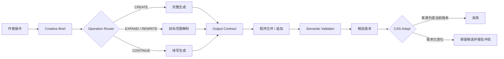

<div align="center">

<h1>开戏 DramaGo</h1>

<p><strong>不是把复杂界面套在 Prompt 外面，而是把 AI 写作变成可追踪、可校验、可安全采用的创作流程。</strong></p>

<p>面向短剧作者的 AI 文字创作工作台，支持生成、扩写、改写与续写。</p>

<p>
  <a href="https://huidian-drumer.github.io/dramago/"></a>
  <a href="https://github.com/Huidian-drumer/dramago/blob/main/LICENSE"></a>
  
  
  
</p>

<p>
  <a href="https://huidian-drumer.github.io/dramago/"><strong>访问项目官网</strong></a>
  ·
  <a href="#快速开始">快速开始</a>
  ·
  <a href="L2_HARDENING_REPORT.md">L2 加固报告</a>
  ·
  <a href="WRAPPER_AUDIT_REPORT.md">Wrapper 审计</a>
</p>

</div>

---

## 项目定位

大多数 AI 写作工具的真实链路是 `UI → Prompt → LLM → Text`。DramaGo 在模型之外增加可验证的产品逻辑：操作路由、可靠选区、程序合并、输出类型契约、版本并发保护、候选稿采用、轻量 Story Facts 与独立语义校验。

当前版本专注纯文字短剧创作，不包含图片、视频、TTS、实时 StoryWorld 或批量生成。

## 核心能力

| 操作 | 模型负责 | 程序负责 | 输出契约 |
| --- | --- | --- | --- |
| `CREATE` | 生成完整作品 | 建立任务、校验并保存候选稿 | `full` |
| `EXPAND` | 生成全文或目标片段 | 可靠选区、片段合并、范围保护 | `full` / `segment` |
| `REWRITE` | 按作者要求重写目标范围 | 版本管理、影响范围与候选稿隔离 | `full` / `segment` |
| `CONTINUE` | 只生成新增内容 | 在原文后程序化追加 | `continuation` |

### 不是只靠模型自律

- 选区操作使用字符区间合并，不通过全文搜索定位第一处同句。
- `full` 冒充 `segment`、超长输出、空响应或非法 JSON 会被拒绝。
- 生成期间若源版本变化，旧候选稿不会覆盖新版本。
- 采用候选稿使用 compare-and-swap，并验证候选来源、正文 hash 与检查报告绑定关系。
- Provider 未配置或失败时明确报错，不使用 fixture 或固定正文冒充成功。
- 独立 Semantic Validator 只报告问题，不静默修改作者正文。

## 执行链路



每次任务都会生成脱敏的 Creative Trace，记录操作、来源版本、目标范围、Provider、模型、模板、合并策略、校验状态和采用结果；不会记录 API Key、Authorization 或完整 Secret。

## 当前成熟度

当前评级为 **可靠 L2**：已具备明确的 operation 逻辑、scope、程序合并、版本保护、candidate/adopt 与错误保护，并加入最小内容保护层。

| 验证项 | 结果 |
| --- | --- |
| 单元与回归测试 | 10 / 10 通过 |
| Wrapper Audit + 故障注入 | 20 项保护链路通过 |
| Source Version Race | 通过 |
| 全文冒充片段 | 通过，阻止采用 |
| 40,000 字符异常片段 | 通过，阻止采用 |
| Prompt Injection 返回 `OK` | 通过，阻止自动采用 |
| 复杂事实与时间线理解 | 保护链路完成，准确率仍依赖独立模型 |

> [!IMPORTANT]
> Semantic Validator 是安全护栏，不是形式化证明。项目不会宣称能够识别所有人物事实、时间线或叙事冲突。

## 快速开始

### 环境要求

- Node.js 20+
- pnpm
- D1-compatible 数据库绑定
- OpenAI-compatible 文本 Provider

### 安装与验证

```bash
git clone https://github.com/Huidian-drumer/dramago.git
cd dramago
pnpm install
pnpm db:generate
pnpm test
pnpm build
pnpm validate
pnpm preview
```

运行完整 L2 审计：

```bash
pnpm audit:l2
pnpm db:validate
```

### 服务端配置

复制 `.env.example` 并在服务端配置以下变量：

| 变量 | 必需 | 说明 |
| --- | --- | --- |
| `OPENAI_API_KEY` | 是 | OpenAI-compatible Provider 密钥 |
| `OPENAI_MODEL` | 是 | Writer 使用的模型 |
| `OPENAI_ENDPOINT` | 否 | 自定义 Provider 端点 |
| `VALIDATOR_MODEL` | 否 | 独立语义校验模型，默认复用 Writer 模型 |
| `MAX_AUTO_REPAIRS` | 否 | 格式修复次数，默认 2，最大 2 |

密钥只从服务端环境读取。前端没有密钥输入框，未配置时返回 `PROVIDER_NOT_CONFIGURED`。

## 项目结构

```text
dramago/
├─ web/                 作者工作台前端
├─ worker/              API、路由、Provider、合并与校验
├─ db/                  Drizzle 数据结构
├─ drizzle/             数据库迁移
├─ test/                单元与回归测试
├─ audit/               Wrapper Audit 与故障注入
├─ script-writer/       Script Writer V0.1 文字链路
├─ docs/                GitHub Pages 项目官网
└─ dist/                可部署构建产物
```

旧互动原型保留在 `/experience`，继续使用 `dramaworld-v02` 浏览器数据，不参与创作请求。

## 文档与证据

- [L2 Hardening Report](L2_HARDENING_REPORT.md)：CAS、输出契约、Story Facts 与语义校验实现证据。
- [Wrapper Audit Report](WRAPPER_AUDIT_REPORT.md)：真实调用链、故障注入与 Wrapper 等级结论。
- [Creative Workbench Report](CREATIVE_WORKBENCH_REPORT.md)：创作工作台调整说明。
- [Creative Trace Sample](audit/CREATIVE_TRACE_SAMPLE.json)：脱敏执行追踪样例。
- [Audit Results](audit/WRAPPER_AUDIT_RESULTS.json)：机器可读测试结果。

## 安全与隐私

不要提交 API Key、Authorization Header、`.env`、用户未脱敏素材或敏感 Provider 配置。发现安全问题时，请不要创建公开 Issue，参见 [SECURITY.md](SECURITY.md)。

## 参与贡献

欢迎提交 Issue 与 Pull Request。开始前请阅读 [CONTRIBUTING.md](CONTRIBUTING.md)，并确保：

1. 不降低现有测试标准；
2. 不用硬编码样例词汇伪装语义理解；
3. 新增检查必须明确 blocking 与 warning 的边界；
4. Provider 失败不得进入假成功路径。

## License

本项目基于 [MIT License](LICENSE) 开源。
